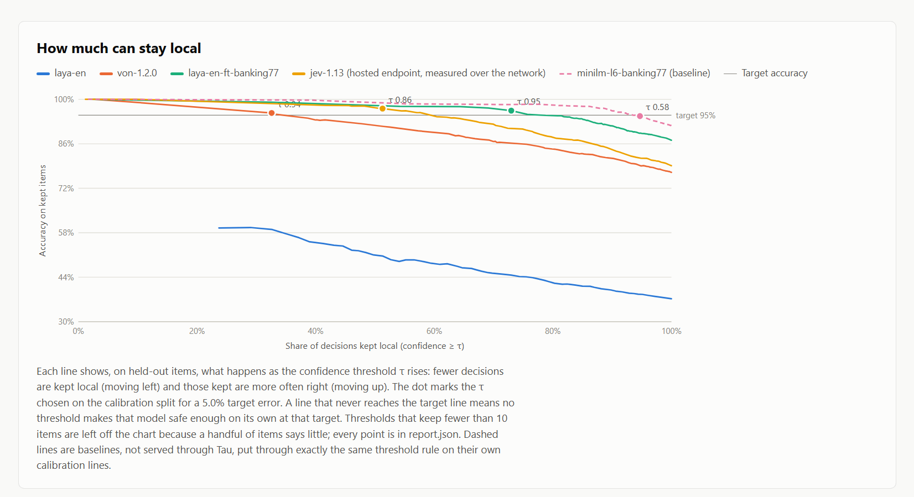
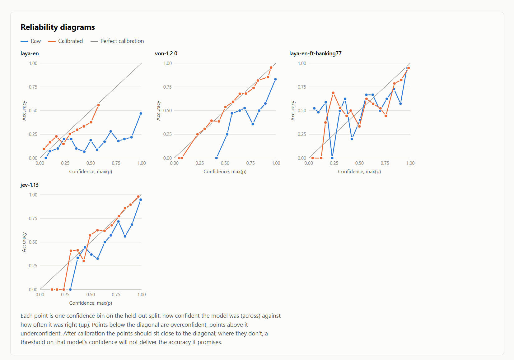
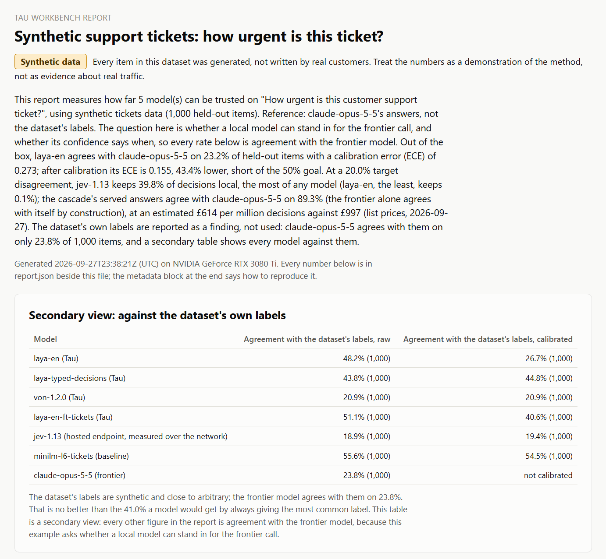
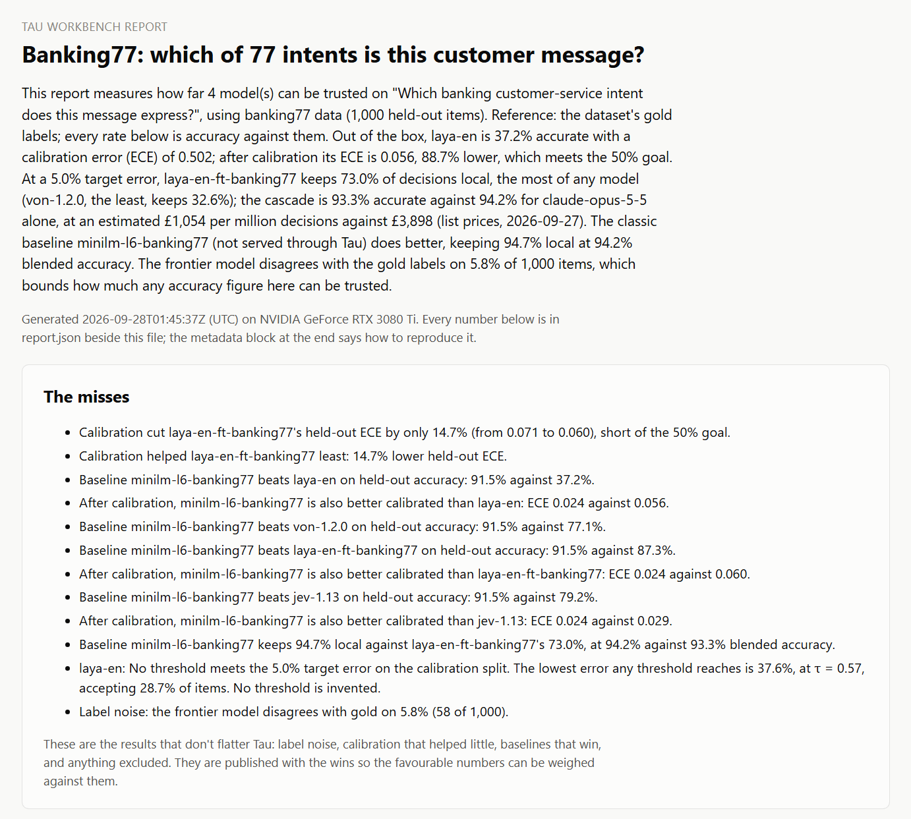

---
# Page metadata for the Tau R&D page. Front matter is data for the build, not page copy.
page:
  url_placeholder: /apex/tau
  url_house_convention: /rd/tau/
  title: "Tau: local-first classification on a gaming GPU · Fortitude Omnis Group"
  meta_description: >-
    Tau is an open-source .NET runtime and workbench for local-first classification, released
    under Apache-2.0 by Fortitude Omnis. The Runtime serves the /v1/systemone decision contract on
    your own hardware, running the open Laya and Von decision models through ONNX Runtime on CUDA,
    DirectML or a CPU. The Workbench asks one question of any /v1/systemone endpoint, local or
    hosted: can I trust this model's confidence enough to gate on it, and what does gating save? It
    measures accuracy and calibration, fits calibrators, picks a confidence threshold, simulates a
    cascade that keeps confident answers local and sends the rest to a frontier model, and prices
    it. On Banking77 (77 banking intents, 1,000 held-out messages), measured on one RTX 3080 Ti on
    27 and 28 September 2026, a fine-tuned Laya model kept 73.0% of decisions local at 93.3%
    blended accuracy, against 94.2% for Claude Opus 5.5 alone, and cut an estimated £3,898 per
    million decisions to £1,054. A fine-tuned MiniLM classifier with 22,742,861 parameters did
    better: 94.7% local at 94.2% blended accuracy, for an estimated £207 per million. TypeSafe's
    hosted Jev model, measured on the same items, scored 79.2% out of the box and kept 51.3% at
    93.6% blended. The pounds are estimates from published list prices, not invoices. The Claude
    answers came from an interactive Claude Code session working through batched answer sheets,
    not from the API. It's one dataset, one card and one night. Calibration took laya-en's expected
    calibration error from 0.502 to 0.056. On a synthetic support-ticket set whose labels turned out
    to be unreliable, no local model was able to stand in for Claude, and Jev was the only model
    that took a real share: 39.8% of decisions at 89.3% agreement with Claude. The code, both
    worked examples, every report and every cached frontier answer are at
    github.com/Fortitude-Group/tau.
  og_title: "Three-quarters of my Claude classification calls could run on a gaming GPU. The surprise is which model."
  og_description: >-
    A fine-tuned Laya decision model kept 73.0% of Banking77 decisions on an RTX 3080 Ti at 93.3%
    blended accuracy against 94.2% for Claude alone. A plain fine-tuned MiniLM kept 94.7% local at
    94.2%. Hosted Jev, on the same items, kept 51.3%. Estimates from list prices, one dataset, one
    card, measured 27 and 28 September 2026. Apache-2.0, with every report in the repo.
  og_image: /images/rd/tau-banking77-tradeoff.png
  queries:
    - is Laya calibrated
    - how do I calibrate Laya
    - self-hosted /v1/systemone server
    - open-source Jev alternative for .NET
    - is Jev calibrated
    - Jev versus a fine-tuned local model for intent classification
    - when do I need a frontier model instead of a decision model
    - can a small model replace Claude for classification
    - how much of my Claude classification traffic can run on a local GPU
    - how do I pick a confidence threshold for an LLM cascade
    - is fine-tuned MiniLM better than a decision model for intent classification
    - what does expected calibration error mean for gating on model confidence
    - run Laya and Von locally with ONNX Runtime on CUDA
    - Banking77 local model versus Claude Opus accuracy and cost

# Entry for the site's R&D data source, in the shape the R&D generator reads.
rd_entry:
  slug: tau
  title: Tau
  subtitle: local-first decisions, measured
  one_liner: >-
    A .NET server that answers the /v1/systemone decision contract on your own GPU, and a
    workbench that tells you how far to trust its confidence, what gating on it saves, and when
    the small classic classifier beats it anyway.
  status: shipped
  tags: [ai, calibration, dotnet]
  hero_media: /images/rd/tau-banking77-tradeoff.png
  hero_alt: >-
    Line chart of accuracy on kept items against the share of decisions kept local, one line per
    model, with the chosen threshold marked on each.
  demo_url: null
  repo_url: https://github.com/Fortitude-Group/tau
  article_url: null
  date: 2026-09-27
  stack:
    - .NET 10
    - ONNX Runtime on CUDA, DirectML or CPU
    - Laya and Von decision models
    - Temperature scaling and isotonic calibration
  draft: true
---

<!--
Note for Rob. This file is content and structure only. Nothing here deploys anything.

The live page is /rd/tau/ on the corporate site. Its body there is built from tau-canonical.md, not
from this file, and its entry in rd/projects.json came from the rd_entry block above. This draft
stays as the structured version of the same content, with the same numbers.

The five images in docs/articles/img/ are copied into the site as /images/rd/tau-banking77-cascade.png,
tau-banking77-tradeoff.png, tau-banking77-reliability.png, tau-banking77-summary.png and
tau-tickets-summary.png.

Every repo link here is relative to docs/articles/ so the article checker can verify it. On the site
they become github.com/Fortitude-Group/tau URLs: ../../examples/banking77/report.json becomes
https://github.com/Fortitude-Group/tau/blob/master/examples/banking77/report.json, and a folder link
uses /tree/master/ instead of /blob/master/.

The front matter numbers are the same ones the body links, sentence for sentence.
-->

# Three-quarters of my Claude classification calls could run on a gaming GPU. The surprise is which model.

*Rob Hill, Fortitude Omnis. Measured on 27 and 28 September 2026. Apache-2.0.*

## Hero

**Eyebrow:** R&D · Tau · Shipped · 2026

**Summary.** I ran a thousand Banking77 support messages through a model on my own RTX 3080 Ti first and only sent the uncertain ones to Claude Opus 5.5. With a fine-tuned Laya decision model doing the local work, [73.0% of decisions stayed on the GPU, blended accuracy was 93.3% against 94.2% for Claude alone, and the estimated bill fell from £3,898 to £1,054 per million decisions](../../examples/banking77/report.json). Those pounds are estimates from list prices on 27 September 2026, not invoices. It's one dataset, one card, one night. And the Claude answers came from an interactive Claude Code session working through batched answer sheets, not from the API, so nobody was billed for them. The surprise is that a plain fine-tuned MiniLM did better than every decision model I tested, TypeSafe's hosted Jev included.

**Calls to action:**

- Primary: [Read the write-up](tau-canonical.md)
- Secondary: [See the code](../../README.md)

## The result: a cascade that keeps three-quarters local

A decision model gives you an answer and a probability. Keep the answer when the probability is high, send the question to Claude when it's low, and most of the frontier bill goes away. That's the cascade.

I fine-tuned laya-en on the [9,003-item training split](../../examples/banking77/dataset.manifest.json), on the same card, in [1,518 seconds](../../examples/banking77/finetune-training.json). With a threshold of [0.95, picked on the calibration split and judged on the held-out split](../../examples/banking77/report.json), it kept 73.0% of decisions and sent the rest to Claude. The blend lost about one point of accuracy against Claude alone.

The money is arithmetic on published prices. Each Banking77 prompt is about [1,259 input tokens](../../examples/banking77/report.json) once you list every intent, so Claude Opus 5.5 at list price comes to [£3,898 per million decisions, or £1,949 through the Batch API](../../examples/banking77/report.json). Sending only the uncertain quarter [drops that to £1,054](../../examples/banking77/report.json). Tokens are estimated from characters, not counted. And Claude [disagreed with the Banking77 labels on 5.8% of items](../../examples/banking77/report.json), so its accuracy is agreement with a dataset that has mistakes of its own.


## The twist: the classic encoder won

I put a fine-tuned all-MiniLM-L6-v2 through the same measurement, calibration, threshold and cascade code as the decision models. It [scored 91.5% on the held-out set, with a calibrated ECE of 0.024](../../examples/banking77/report.json), against 87.3% for the fine-tuned Laya. In the cascade it [kept 94.7% local at the same 94.2% blended accuracy as Claude alone, for an estimated £207 per million](../../examples/banking77/report.json). It has [22,742,861 parameters](../../examples/banking77/baselines/minilm-l6-banking77.training.json). It wasn't served through Tau, so that figure leaves out local latency and energy.

My [first MiniLM run scored 80.8%](../DECISIONS.md), because I'd stopped it after five epochs with the loss still falling. A baseline trained that badly flatters whatever you compare it with, so I retrained it properly before I believed anything. The mistake and the fix are in the [decisions log](../DECISIONS.md).

On a fixed task with thousands of labelled examples, a classic small classifier is still the thing to beat. Decision models earn their keep elsewhere: questions you haven't trained for, many questions against one state, tasks where writing the options down is all the training you'll get. The part of Tau I'd defend hardest is the Workbench, because it measured its own models losing and printed it in the report.



## Calibration: making the confidence mean something

Gating on a probability only works if 0.9 means right nine times in ten. Out of the box, it doesn't. On Banking77, [laya-en was 37.2% accurate with an expected calibration error (ECE) of 0.502](../../examples/banking77/report.json). Put roughly, its stated confidence sat about 50 points away from its hit rate.

Calibration changes what the number means and leaves the model alone. Fitting a small calibrator on a separate 1,000-item split took [laya-en's ECE from 0.502 to 0.056, 88.7% lower](../../examples/banking77/report.json), and [Von's from 0.185 to 0.021](../../examples/banking77/report.json). Accuracy didn't move. The confidence became something you can threshold.

One detail I'd have skipped in a hurry. Laya's contract returns a `confidence` field for choice questions that isn't a calibrated probability at all, because it's derived from the entropy of the whole distribution. Every calibration figure here is on the probability of the chosen answer instead, and the reports say so.



## The benchmark that lied

The second dataset was meant to be support-ticket urgency, from very low to critical. I picked a public set with [61,765 tickets](../../examples/support-tickets/dataset.manifest.json) and priority labels. It turned out to be synthetic, generated by a model.

Claude labelled 1,000 of them and [agreed with the dataset's labels on 23.8% of items](../../examples/support-tickets/report.json). Always answering the most common label [would score 41.0%](../../examples/support-tickets/report.json). Asked two different ways, Claude [agreed with itself on 76.5%](../../examples/support-tickets/report.json), so urgency is a genuine judgement call. The labels were the bigger problem. I read the disagreements: a suspected breach exposing medical records was labelled "medium", and a one-line request for information was "high".

MiniLM [agreed with the synthetic labels on 55.6%](../../examples/support-tickets/report.json), well above Claude. It had learned the generator's habits, which have little to do with urgency. If I'd trusted the dataset, the headline would have been "a 22M model beats Claude at triage", and it would have been wrong.

So I scored this example against Claude's answers instead, asking whether a local model can stand in for the frontier call. None can. At a 20% disagreement target, [laya-en, laya-typed-decisions and Von each kept 0.1% of decisions local, and the fine-tuned Laya found no threshold at all](../../examples/support-tickets/report.json). On judgement calls like this, the small models can't do the frontier model's work.



## Jev, the hosted model

Jev is TypeSafe's hosted decision model (`jev-1.13.0`), and it answers the same `/v1/systemone` contract. The Workbench measured it over the network on the same items, with the same calibration, threshold and cascade code as the local models. It cost an estimated [$0.14 for Banking77](../../examples/banking77/report.json) and [$0.04 for the tickets](../../examples/support-tickets/report.json), at the published [$0.042 per million input tokens](../../examples/banking77/report.json).

On Banking77 it's a solid generalist: [79.2% held-out out of the box, ahead of laya-en's 37.2% and Von's 77.1%, with an ECE of 0.093 before calibration and 0.029 after](../../examples/banking77/report.json). As the first stage of a cascade it [kept 51.3% at 93.6% blended, for an estimated £1,952 per million against £3,898](../../examples/banking77/report.json), counting its own calls. The fine-tuned Laya beat it at [87.3% and 73.0% kept local](../../examples/banking77/report.json), and MiniLM beat both.

On the tickets it's the only model besides Claude that takes a real share. It [agreed with Claude on 52.5% out of the box, ahead of every local model](../../examples/support-tickets/report.json), and at the 20% target it [kept 39.8% of decisions with the served answers agreeing with Claude on 89.3%, for an estimated £614 per million against £997](../../examples/support-tickets/report.json).

Its probabilities come back [rounded to 2 decimal places](../DECISIONS.md), and a hosted endpoint can't load a calibrator, so its calibrated figures are the Workbench applying one offline. Its median response took [223 ms](../../examples/banking77/report.json) over the network, which isn't comparable with local inference.

Figure: none. Jev appears in the cascade, trade-off and reliability figures above.

## The misses

- **I fitted the calibrators on rounded numbers.** The Workbench fitted them on the Runtime's 4-dp output, and the Runtime applied them to unrounded probabilities. The first version of this page quoted [laya-en's calibrated ECE as 0.065 and Von's as 0.039](../DECISIONS.md). Fitted on full precision they're [0.056 and 0.021](../../examples/banking77/report.json). The claim that the Workbench and the Runtime agree within 2.4e-4 had only been checked on inputs that didn't saturate, and the [decisions log](../DECISIONS.md) corrects it.
- **Three models on one card slowed the last one to seconds per request.** The fine-tuned Laya, measured last with three FP32 models resident, had [a median of 15,219 ms per request](../../examples/banking77/runs/laya-en-ft-banking77/heldout.raw.summary.json) in its raw phase, against [243 ms](../../examples/banking77/runs/laya-en-ft-banking77/heldout.calibrated.summary.json) in a fresh Runtime. VRAM spill is the likely cause, not proven. Accuracy isn't affected, and the published latency comes from the clean phase.
- **Calibration barely helped the fine-tuned Laya on Banking77:** [ECE went from 0.071 to 0.060](../../examples/banking77/report.json). Fine-tuning had already fitted its temperature.
- **laya-en on the tickets missed the 50% calibration target:** [ECE went from 0.273 to 0.155, 43% lower](../../examples/support-tickets/report.json). The Workbench picks the calibrator with the lower log loss on the calibration split, which picked isotonic regression even though temperature scaling had [a calibration-split ECE of 0.016 against 0.216](../../examples/support-tickets/calibrators/laya-en/calibration-summary.json). I set that rule before seeing any held-out result, so I didn't change it afterwards.
- **Von's tickets calibration moved [ECE from 0.045 to 0.042](../../examples/support-tickets/report.json).** It was already close to calibrated.
- **My own report misled me.** Its summary first quoted the cascade of the first model in the list rather than the best one, and I repeated that to myself before reading the table. The summary now quotes the best cascade, and the fix has a test.



## How it was measured

- **Hardware:** one RTX 3080 Ti (12 GB), i9-11900K, Windows 10, .NET 10, ONNX Runtime 1.24.4, FP32.
- **Data:** Banking77 at a pinned commit, [split with seed 42 into 9,003 training, 1,000 calibration and 1,000 held-out items](../../examples/banking77/dataset.manifest.json). The tickets set at a pinned revision, English only, deduplicated. No ticket text is published.
- **Frontier labels:** Claude Opus 5.5, answered in an interactive Claude Code session by subagents working through sheets of up to 200 items, each item judged on its own. No API calls were made. Every answer is cached with provenance and committed. A model answering 200 items in one context isn't the same as 200 separate calls, and I'd rather say so than have you find it.
- **Hosted endpoint:** Jev, called over the network with the key read from an environment variable at run time and never written anywhere, under a budget guard.
- **ONNX parity:** every model export was checked against the PyTorch reference, including both fine-tunes, [within a logit tolerance of 0.002](../../examples/banking77/finetune-parity.json).
- **Speed:** on the 3080 Ti with CUDA, laya-en answers [one question in 18.59 ms and ten questions about one state in 114.11 ms](../../reports/r1/latency.md). On the CPU, the single question takes [529.21 ms](../../reports/r1/latency.md). FP32 medians.
- **Prices:** Anthropic's list prices on 27 September 2026, converted at the ECB rate of 25 September, and Jev's published input price. Estimates, labelled as such in every report.

Figure: none. This section is a list.

## Reproduce it

The repo holds both worked examples with their reports, calibrators, cached frontier answers and per-item results. On a machine with the models fetched, one command reruns an example end to end and rewrites its report:

```
./scripts/examples.ps1 -Example banking77
```

Re-measuring Jev needs your own TypeSafe key. Read [the Banking77 report](https://fortitude-omnis.group/rd/files/tau/banking77.html) and [the tickets report](https://fortitude-omnis.group/rd/files/tau/support-tickets.html) first. They carry the misses in more detail than this page does, and they were harder on me than I was.

Figure: none. The command is the call to action.

## What's in the repo

- **The Runtime** ([src/Tau.Runtime](../../src/Tau.Runtime)). A .NET server that answers the `/v1/systemone` decision contract locally, running Laya and Von through ONNX Runtime on CUDA, DirectML or a CPU. Anything that already talks to that contract can point at it instead of a hosted endpoint.
- **The Workbench** ([src/Tau.Workbench.Cli](../../src/Tau.Workbench.Cli)). A command-line tool that measures accuracy and calibration against any `/v1/systemone` endpoint, local or hosted, fits calibrators, picks a threshold, simulates the cascade, prices it and writes a single HTML report.
- **Tau.Client** ([src/Tau.Client](../../src/Tau.Client/README.md)). A typed .NET client for any `/v1/systemone` server. Ask for an enum and get the answer back with its probabilities. Pack it locally for now.
- **Two worked examples.** [Banking77](../../examples/banking77) and [the support tickets](../../examples/support-tickets), each with its dataset manifest, calibrators, cached frontier answers, per-item runs and report.
- **The reports.** The two example reports above, plus [latency](../../reports/r1/latency.md), [ONNX parity](../../reports/r1/parity.md) and [contract conformance](../../reports/r1/conformance.md) for the Runtime.

## Byline

Rob Hill, Fortitude Omnis. 28 September 2026. Licensed under [Apache-2.0](../../LICENSE).
