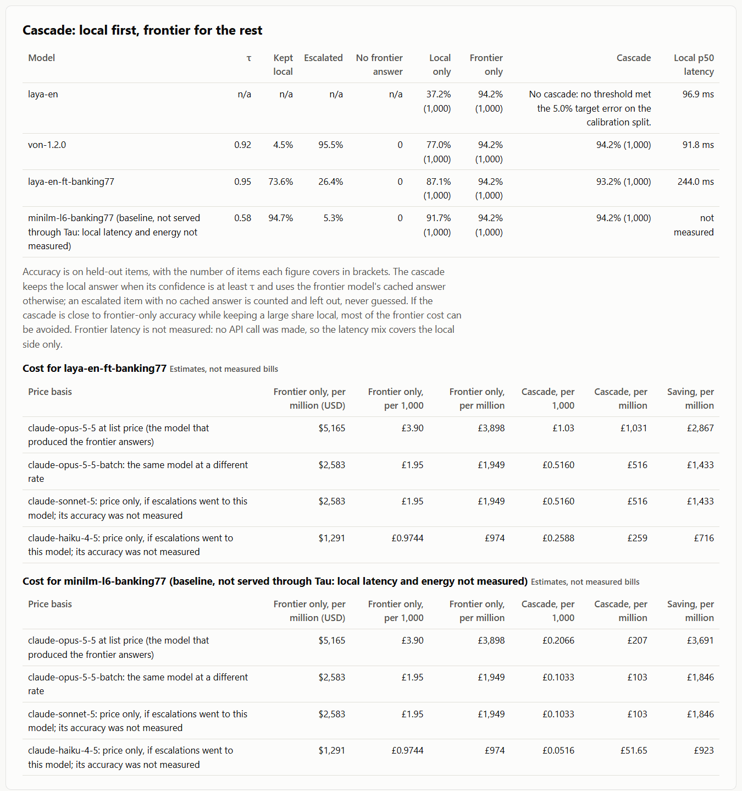

*Rob Hill, Fortitude Omnis. Measured on 27 September 2026.*

I sent a thousand Banking77 support messages through a model on my own RTX 3080 Ti first, and only passed the uncertain ones to Claude Opus 5.5. With a fine-tuned Laya decision model doing the local work, [73.6% of decisions stayed on the GPU, blended accuracy was 93.2% against 94.2% for Claude alone, and the estimated bill fell from £3,898 to £1,031 per million decisions](../../examples/banking77/report.json). The caveats belong right here. It's one dataset (Banking77), one card, one date. The £ figures are estimates from published list prices, not invoices. And Claude's answers came from an interactive Claude Code session working through batched answer sheets, not from the API.

The twist is the model that did best. A plain fine-tuned MiniLM classifier [kept 94.7% local at the same 94.2% blended accuracy as Claude alone](../../examples/banking77/report.json). I'll come back to that.

This post is the hands-on version. It shows how to run the server, how to calibrate a model's confidence, and how to get the same report for your own decision. The full write-up is on the [Fortitude Omnis R&D page](https://fortitude-omnis.group/rd/tau/) (placeholder).

## What is Tau?

Tau is two things, both Apache-2.0.

The **Runtime** is a .NET server that answers the `/v1/systemone` decision contract locally. It runs the open Laya and Von decision models through ONNX Runtime on CUDA, DirectML or a CPU. You send it some state and a set of questions, and it sends back an answer with a probability for each option.

The **Workbench** is a command-line tool called `tau`. It asks one question of any `/v1/systemone` endpoint: can I trust this model's confidence enough to gate on it, and what does gating save? Every stage writes its output to disk, and the last one writes a single HTML report with the misses left in.

## How do I run a self-hosted /v1/systemone server?

The repo's README walks through fetching a model, exporting it to ONNX and fetching the ONNX Runtime natives. After that, starting the Runtime on an NVIDIA card is one line:

```powershell
dotnet run --project src/Tau.Runtime -c Release -- --urls http://localhost:8088 --Tau:Provider=cuda
```

Leave out `--Tau:Provider=cuda` and it runs on the CPU. On Windows, `--Tau:Provider=directml` runs on any DirectX 12 GPU. It refuses to start if the provider you asked for won't load, which I prefer to a silent fallback to the CPU.

Then ask it something:

```bash
curl -s http://localhost:8088/v1/systemone \
  -H "Content-Type: application/json" \
  -d '{
    "model": "jev-latest",
    "state": "My card payment failed three times this morning and I need it sorted today.",
    "questions": {
      "category": {
        "type": "choice",
        "instructions": "Which support category fits this message?",
        "criteria": {
          "billing": "Billing or payments issue",
          "technical": "App or website technical issue",
          "account": "Account access or security issue"
        }
      },
      "urgent": { "type": "noul", "instructions": "Does the customer need an answer today?" }
    }
  }'
```

`jev-latest` is an alias that lets the Runtime pick a model. English text goes to `laya-en`. You get back a `choice` with a probability for each option, plus a `noul` score for the yes/no question. `GET /v1/models` lists what's loaded.

From C#, the `Tau.Client` package wraps the same call and maps the answer onto an enum:

```csharp
using Tau.Client;

using var client = new SystemOneClient(new Uri("http://localhost:8088/"));

var decision = await client.DecideAsync<Category>(
    state: "My card payment failed three times this morning and I need it sorted today.",
    instructions: "Which support category fits this message?");

Console.WriteLine($"{decision.Value} p={decision.Probabilities[decision.Value]:F2}");

enum Category { Billing, Technical, Account }
```

## How fast is it on a gaming GPU?

On the 3080 Ti with CUDA, laya-en answers [one question in 18.59 ms and ten questions about one state in 114.11 ms](../../reports/r1/latency.md). On the i9-11900K's CPU, the single question takes [529.21 ms](../../reports/r1/latency.md). Those are FP32 medians with no FP16 tricks. I haven't compared against a hosted endpoint because I didn't buy a key.

## How do I calibrate Laya's confidence scores?

This is the bit that matters, and the reason the Workbench exists. A decision model gives you an answer and a probability. You want to keep the answer when the probability is high and escalate when it's low. That only works if 0.9 means right nine times in ten.

Out of the box, it doesn't. On Banking77, [laya-en was 37.2% accurate with an expected calibration error (ECE) of 0.502](../../examples/banking77/report.json). Its stated confidence sat about 50 points away from its hit rate. A confidence score that looks certain and means nothing.

Calibration fixes the meaning of the number and leaves the model alone. Fitting a small calibrator on a separate 1,000-item split took [laya-en's ECE from 0.502 to 0.065](../../examples/banking77/report.json), and [Von's from 0.185 to 0.039](../../examples/banking77/report.json). Accuracy didn't move.


The Workbench does it in stages. You describe the decision in a `decision.yaml` (the question, the labelled data, the local models, the frontier model and a target error), then run:

```powershell
tau label     examples/banking77/decision.yaml   # ingest cached frontier answers
tau measure   examples/banking77/decision.yaml   # raw accuracy and ECE, calibration and held-out splits
tau calibrate examples/banking77/decision.yaml   # fit temperature and isotonic calibrators
# restart the Runtime with --Tau:CalibratorsDirectory=examples/banking77/calibrators, then:
tau measure   examples/banking77/decision.yaml --phase calibrated
tau threshold examples/banking77/decision.yaml   # pick the threshold for the target error
tau cascade   examples/banking77/decision.yaml   # simulate local-first and price it
tau report    examples/banking77/decision.yaml   # write report.json and report.html
```

`tau run` does the lot in order and skips stages whose outputs are current. It never calls a paid API. If frontier answers are missing, `tau label` exports batches to be answered and exits with code 2.

One trap I nearly fell into. Laya's contract returns a `confidence` field for choice questions that's derived from the entropy of the whole distribution, so it isn't a calibrated probability. Calibrate and threshold on the probability of the chosen answer instead. That's why the C# example above prints `Probabilities[decision.Value]`.

## How do I decide how much can stay local?

A calibrated model is only useful if it's also right often enough. Raw laya-en wasn't: [no threshold got its error below 5%](../../examples/banking77/report.json). So I fine-tuned it on the [9,003-item training split](../../examples/banking77/dataset.manifest.json), on the same card, in [1,518 seconds](../../examples/banking77/finetune-training.json).

With a threshold of [0.95, picked on the calibration split and judged on the held-out split](../../examples/banking77/report.json), the fine-tuned model kept 73.6% of decisions local and sent the rest to Claude.



The money is arithmetic on list prices. Each Banking77 prompt is about [1,259 input tokens](../../examples/banking77/report.json) once you list all 77 intents, so Claude Opus 5.5 comes to [£3,898 per million decisions, or £1,949 through the Batch API](../../examples/banking77/report.json). Tokens are estimated from characters, not counted. I haven't costed the GPU, which I already owned for less serious reasons.

## Why did a classic encoder win?

I put a fine-tuned all-MiniLM-L6-v2 through exactly the same measurement, calibration, threshold and cascade code. It [scored 91.5% on the held-out set, with a calibrated ECE of 0.024](../../examples/banking77/report.json), against 87.3% for the fine-tuned Laya. In the cascade it [kept 94.7% local for an estimated £207 per million](../../examples/banking77/report.json). It isn't served through Tau, so that figure leaves out local latency and energy.

On a fixed task with thousands of labelled examples, a small classifier is still the thing to beat. Decision models earn their keep on questions you haven't trained for, or many questions against one state. I'd rather the Workbench told me that than hid it.

The second dataset was worse. On synthetic support tickets, Claude [agreed with the labels on 23.8% of items against a 41.0% majority baseline, MiniLM "learned" them to 55.6%, and scored against Claude instead, every model kept about 0.1% local](../../examples/support-tickets/report.json). On urgency, nothing local stands in for the frontier call.

## What went wrong?

- **The classic encoder beat every Tau model on Banking77,** on accuracy and on calibration.
- **The ticket labels are close to noise.** Claude agreed with them less often than a constant guess would.
- **On urgency, no local model stands in for Claude.** [About 0.1% of decisions stayed local](../../examples/support-tickets/report.json).
- **Calibration barely helped the fine-tuned Laya:** [ECE went from 0.071 to 0.061](../../examples/banking77/report.json). Fine-tuning had already fitted its temperature.
- **laya-en missed the 50% calibration target on the tickets:** [ECE went from 0.273 to 0.148](../../examples/support-tickets/report.json). The Workbench picks the calibrator with the lower calibration-split log loss, which chose isotonic even though temperature scaling had [a calibration-split ECE of 0.016 against 0.201](../../examples/support-tickets/calibrators/laya-en/calibration-summary.json). I set that rule before seeing any held-out result, so I didn't change it.
- **Von's tickets calibration moved [ECE from 0.045 to 0.040](../../examples/support-tickets/report.json).** It was already close.
- **My first MiniLM run [scored 80.8%](../DECISIONS.md)** because I stopped it after five epochs with the loss still falling. That flatters whatever you compare it with, so I retrained it properly.
- **Claude [disagreed with the Banking77 labels on 5.8% of items](../../examples/banking77/report.json).** Some are Claude's mistakes and some are the dataset's.

## How do I reproduce it?

The repo holds both worked examples with their reports, calibrators, cached frontier answers and per-item results. With the models fetched and the CUDA natives in place, one command reruns Banking77 end to end and rewrites its report:

```powershell
./scripts/examples.ps1 -Example banking77
```

It checks the data and model packages first and prints the exact command for anything missing. Then read [the Banking77 report](../../examples/banking77/report.html) and [the tickets report](../../examples/support-tickets/report.html). They were harder on me than I've been here.

The repo is at https://github.com/Fortitude-Group/tau (placeholder until it's public).
